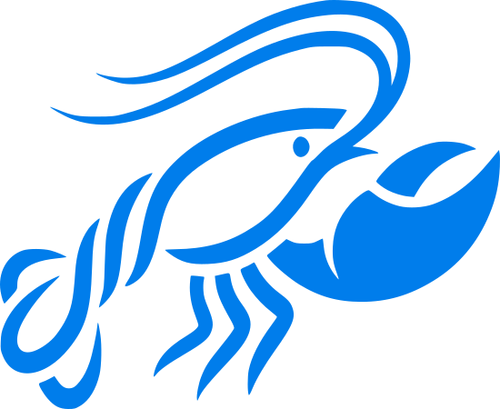

<p align="center">
  
</p>

<h1 align="center">ClawX-Cat</h1>

<p align="center">
  <strong>A desktop client for OpenClaw workflows</strong>
</p>

<p align="center">
  <a href="#project-notes">Project Notes</a> •
  <a href="#quick-start">Quick Start</a> •
  <a href="#windows">Windows</a> •
  <a href="#linux">Linux</a> •
  <a href="#common-commands">Common Commands</a> •
  <a href="#repository-layout">Repository Layout</a>
</p>

<p align="center">
  
  
  
  
</p>

<p align="center">
  English | <a href="README.zh-CN.md">简体中文</a> | <a href="README.ja-JP.md">日本語</a>
</p>

---

## Project Notes

`ClawX-Cat` is a desktop project organized around real OpenClaw usage. The goal is not to mirror the CLI one-to-one, but to provide a practical GUI for setup, provider access, chat, channel management, scheduled tasks, and day-to-day operations.

It continues from the `ClawX` codebase, but is maintained here as an independent work under the `ClawX-Cat` name. The upstream repository is listed below only as a technical lineage reference, not as the main product description for this repository.

- Upstream project: <https://github.com/ValueCell-ai/ClawX>

If you are opening this repository to the public or planning secondary development, a good mental model is: Electron shell, React UI, main-process routes, OpenClaw integration, and packaging scripts already wired together.

## What This Repository Is Good For

- shipping an OpenClaw-based desktop app to non-CLI users
- standing up a configurable AI workbench on Windows or Linux
- using the existing codebase as a foundation for custom branding and product changes
- extending channels, providers, skills, or internal workflow integrations

## Core Capabilities

- visual management for providers, API keys, proxy settings, and runtime options
- desktop entry points for chat, channels, skills, and scheduled jobs
- main-process owned Host API access instead of renderer-side direct service calls
- Electron packaging flow for multi-platform delivery
- a practical base for further OpenClaw-compatible product work

## What ClawX-Cat Adds Beyond ClawX

Compared with using the upstream desktop client as-is, `ClawX-Cat` leans more clearly toward “deployable, extensible, and ready for downstream product work.” The points below are not just marketing language; they map to tooling, scripts, routes, and UI structure that already exist in this repository.

- **Linux is treated as a first-class runtime, not just an afterthought**: the repository does not stop at a desktop launch path. It also prepares Linux and headless usage with bundled operational scripts such as `clawx-update.sh`, `start_clawx_headless.sh`, `set_clawx_bridge_token.sh`, and `clawx-uninstall.sh`. In practice, that means install, lightweight startup, bridge token setup, update, and cleanup are all closer to an actual server-side delivery path instead of being left to ad hoc shell work.
- **Lightweight startup lowers the barrier for remote-host deployment**: many real deployments do not need a full-time desktop session. They need the service, bridge, and remote-control layer to come up reliably first. ClawX-Cat is already moving in that direction, which makes it more suitable for always-on hosts, remote boxes, and operational environments where APP-side or bridge-side access matters more than a local GUI.
- **Version switching and OpenClaw upgrades are part of the workflow**: the repository includes `set-version.cjs`, `set-version.bat`, and `scripts/update-openclaw.ps1`. That turns app-version updates and OpenClaw-version changes into repeatable scripted operations rather than manual edits across `package.json`, installed dependencies, and build cache. For maintainers and downstream teams, this directly improves release discipline.
- **Linux packaging is organized by arch, target, and OpenClaw track**: `scripts/build-linux-package.ps1` is more than a thin electron-builder wrapper. It coordinates architecture, output format, update track, OpenClaw track, output staging, and support-script copying. That is a strong signal that ClawX-Cat is being shaped for maintainable Linux distribution and update flows, not just one-off local builds.
- **Windows builds are also structured for product variants**: `scripts/build-win-variants.cjs` already supports multiple build profiles and OpenClaw tracks. That makes it easier to manage main/proxy editions, internal variants, or parallel validation builds instead of being locked into a single default Windows package.
- **Bridge capability expands from a single WS path to WS + HTTP**: ClawX-Cat keeps the existing `WebSocket Bridge` while adding an `HTTP Bridge` mirror path. Commands go through `POST /api/bridge-http/command` and events through `GET /api/bridge-http/events`. The significance is not only “one more API,” but that APP clients, weak networks, proxy layers, SSE-friendly integrations, and remote-control flows become much easier to support cleanly.
- **APP-side connectivity is backed by explicit design work, not just an idea**: the repository already contains `doc/UniApp/` as a dedicated design area for the ClawX-Cat APP / UniApp client, covering page architecture, protocol design, task breakdown, and joint testing plans. That gives APP-side connection to ClawX-Cat a concrete roadmap and makes mobile control, mobile monitoring, and remote duty scenarios much more realistic.
- **That same direction makes collaborative “shrimp farming” style workflows more plausible**: once you combine Linux lightweight startup, dual bridge paths, APP access, and multi-agent infrastructure, the project becomes naturally suited to multi-terminal and multi-role collaboration. In other words, scenarios like shared shrimp-farming workflows, joint operations, and distributed supervision are easier to build on top of this branch than on a plain upstream desktop baseline.
- **Multi-agent support is no longer just a backend concept**: the codebase already exposes dedicated agent pages, `agent:` session keys, `@agent` routing in chat, multi-agent session handling, and execution-graph related UI. That gives ClawX-Cat a real starting point for multi-agent management, agent-to-agent communication flows, and division-of-labor orchestration rather than leaving those ideas buried in the runtime only.
- **The UI is being reorganized around fewer steps and clearer operation paths**: beyond the usual chat, channels, and skills surfaces, the project already includes a file management page, SkillHub entry points, and recommended setup/configuration flows. The value here is practical: lower model-configuration friction, fewer manual steps, and a friendlier path for non-technical operators.
- **It behaves more like a product branch than a simple rebrand**: if all you needed was a renamed upstream desktop shell, you would not usually add Linux operational scripts, version-management helpers, dual bridge paths, APP-side design material, and more explicit multi-agent UI structure. The real highlight of ClawX-Cat is that these pieces are beginning to connect into a broader product direction.

### Bridge Documentation

If you plan to integrate remote control, APP-side access, scripts, or third-party clients, start with these two dedicated documents:

- [ClawX-Cat-HTTP-Bridge-接口文档.md](doc/ClawX-Cat-HTTP-Bridge-接口文档.md)
- [ClawX-Cat-WebSocket-Bridge-接口文档.md](doc/ClawX-Cat-WebSocket-Bridge-接口文档.md)
- [ClawX-Cat-Bridge-命令类型清单.md](doc/ClawX-Cat-Bridge-命令类型清单.md)

They cover:

- `HTTP Bridge`: command endpoints, SSE event stream, token auth, bridge management APIs, and integration examples
- `WebSocket Bridge`: first-frame auth, command messages, server messages, streaming events, and session subscription behavior
- `Bridge command catalog`: every supported `type`, its `params`, the typical response `type`, and example request bodies

## Quick Start

### Requirements

- OS: Windows 10/11 x64, Linux x64/arm64
- Node.js: 22+ minimum, 24 LTS recommended
- Git: required to clone and update the repository
- pnpm: use the version pinned in `package.json`, preferably via Corepack
- Memory: 4GB minimum, 8GB recommended
- Disk: reserve at least 4GB for dependencies, build outputs, and packaging cache

### Clone the Repository

Replace the placeholder below with your actual public repository URL:

```bash
git clone <your-repo-url>
cd <your-repo-directory>
```

### Initialize Dependencies

```bash
corepack enable
corepack prepare pnpm@10.31.0 --activate
pnpm --version
pnpm run init
```

Notes:

- `pnpm run init` installs dependencies and downloads the bundled `uv` binaries used by the project
- if needed, you can also run `pnpm install` and `pnpm run uv:download` separately

### Start Local Development

```bash
pnpm dev
```

Useful validation commands after startup:

```bash
pnpm run lint
pnpm run typecheck
pnpm test
pnpm run build:vite
```

## Windows

### Recommended Environment

- `Git for Windows`
- `Node.js 24 LTS`
- `PowerShell 7` or Windows PowerShell 5.1+
- `corepack` with the pinned pnpm version activated

### End-to-End Setup Commands

```powershell
git clone <your-repo-url>
cd <your-repo-directory>
corepack enable
corepack prepare pnpm@10.31.0 --activate
pnpm run init
pnpm dev
```

### Windows Packaging

Use the repository-root packaging script directly instead of presenting `pnpm package:*` as the main release entry:

```powershell
.\build.bat
```

Notes:

- `build.bat` is the intended Windows release entry script
- it optionally accepts a version argument, for example: `.\build.bat 1.2.3`
- the script runs `node set-version.cjs <version>` first when a version is provided, then calls `pnpm run package:win:variants`
- the final output is a dual-track Windows release set written to the `release` directory

### Windows Notes

- `pnpm dev` is enough for most UI and integration work
- for a quick build-only check, run `pnpm run build:vite`
- Windows packaging takes noticeably longer than normal dev startup because extra assets and binaries are prepared
- in restricted networks, make sure npm registry access and binary downloads are available
- the packaging script still depends on `node` and `pnpm`, so run `pnpm run init` first

## Linux

### Recommended Environment

Prepare at least the following:

- `git`
- `Node.js 24 LTS`
- `corepack`
- common desktop libraries
- `xvfb` for headless Electron testing

A common Debian / Ubuntu dependency example:

```bash
sudo apt update
sudo apt install -y git curl build-essential libgtk-3-0 libnotify4 libxss1 libxtst6 libnss3 libasound2 xvfb
```

### End-to-End Setup Commands

```bash
git clone <your-repo-url>
cd <your-repo-directory>
corepack enable
corepack prepare pnpm@10.31.0 --activate
pnpm run init
pnpm dev
```

### Linux Packaging

Linux packaging should also be documented through the repository-root bat wrappers instead of `pnpm package:linux` as the primary entry.

1. `build_linux_amd.bat`
   - builds the `AMD64 Debian` dual-track package set
   - includes both stable and latest OpenClaw variants

2. `build_linux_arm.bat`
   - builds the `ARM64 Debian` dual-track package set
   - intended for ARM Linux devices or ARM servers

3. `build_linux_generic_amd.bat`
   - builds the `AMD64 generic/headless Linux` package set
   - outputs a portable `tar.gz` artifact for generic or headless Linux deployment

Examples:

```powershell
.\build_linux_amd.bat
.\build_linux_arm.bat
.\build_linux_generic_amd.bat
```

If you want to update the app version at packaging time, pass a version argument:

```powershell
.\build_linux_amd.bat 1.2.3
.\build_linux_arm.bat 1.2.3
.\build_linux_generic_amd.bat 1.2.3
```

These bat wrappers ultimately call `scripts/build-linux-package.ps1` and copy the Linux operational helper scripts into the output directory as part of the build flow.

### Linux Notes

- with a desktop session, `pnpm dev` can run directly
- on headless hosts, prefer `lint`, `typecheck`, `test`, and `build:vite`
- for Electron E2E in headless environments, use:

```bash
xvfb-run -a pnpm run test:e2e
```

- AppImage targets may require `libfuse2` or `libfuse2t64`

## Common Commands

| Task | Command |
|------|---------|
| Initialize project | `pnpm run init` |
| Start development | `pnpm dev` |
| Run ESLint | `pnpm run lint` |
| Run typecheck | `pnpm run typecheck` |
| Run unit tests | `pnpm test` |
| Run E2E tests | `pnpm run test:e2e` |
| Build frontend only | `pnpm run build:vite` |
| Build Windows dual-track release | `.\build.bat` |
| Build Windows release with version update | `.\build.bat 1.2.3` |
| Build Linux AMD64 Debian release | `.\build_linux_amd.bat` |
| Build Linux ARM64 Debian release | `.\build_linux_arm.bat` |
| Build Linux AMD64 generic release | `.\build_linux_generic_amd.bat` |

## Repository Layout

```text
ClawX-Cat/
├── electron/                # Electron main process, Host API routes, gateway and system integration
├── src/                     # React renderer pages and components
├── tests/                   # Unit tests and Electron E2E
├── resources/               # Icons, screenshots and other static assets
├── scripts/                 # Build, download and packaging helper scripts
├── build/                   # Bundled resources and OpenClaw-related build outputs
└── README*.md               # Multi-language project documentation
```

## Development Notes

- prefer `host-api` / `api-client` as the renderer-side entry for backend capabilities
- avoid adding raw `ipcRenderer.invoke(...)` calls directly inside page components
- before public packaging, review `package.json` scripts and `.github/workflows` together
- when behavior changes, update all README variants in the same commit to avoid language drift

## License

This repository uses the [MIT License](LICENSE). If you redistribute or extend it, also review the licenses of any new dependencies and bundled assets you add.
